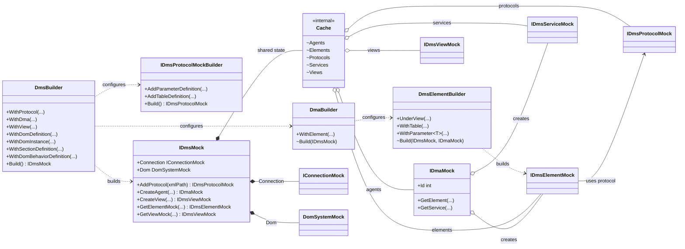
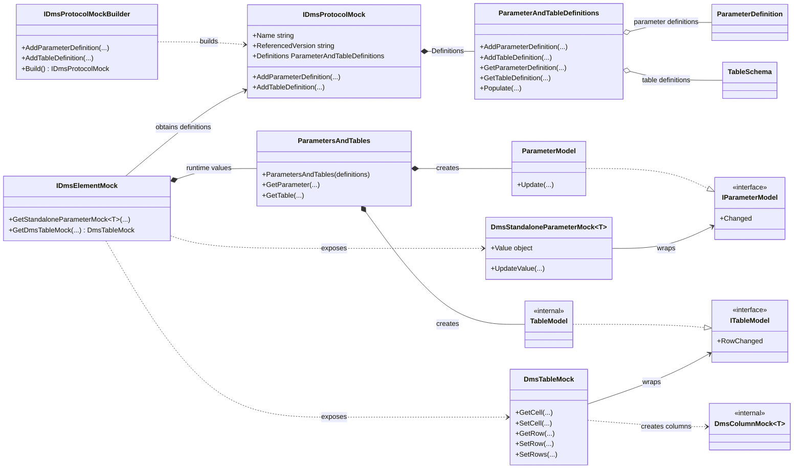
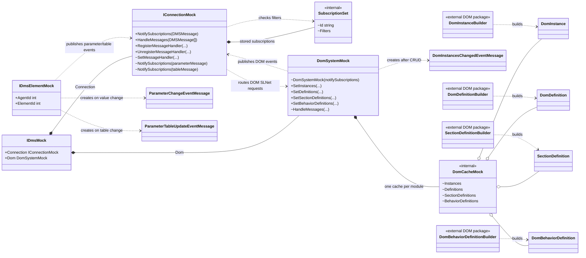

# DataMiner System Mock Class Diagram

This document shows the main classes of the DataMiner System mock and how the DMS, protocol, parameter, table, DOM, and connection parts are connected.

`+` means public, `~` means internal, `*--` means ownership, and `..>` means that one class uses or creates another class.

## DMS construction and ownership

## Protocol, parameters, and tables

The protocol contains definitions only. Each element uses those definitions to create its own `ParametersAndTables`, so two elements can use the same protocol while keeping separate runtime values.

## DOM and message flow

The message flow is:

1. A parameter, table, or DOM value changes.
2. The responsible mock creates the matching DataMiner event message.
3. `IConnectionMock` checks active subscription filters.
4. When a subscription matches, `IConnection.OnNewMessage` is raised.

DOM request messages follow the opposite direction: `IConnectionMock` forwards them to `DomSystemMock.HandleMessages`, and `DomSystemMock` reads or changes the `DomCacheMock` belonging to the requested module.
